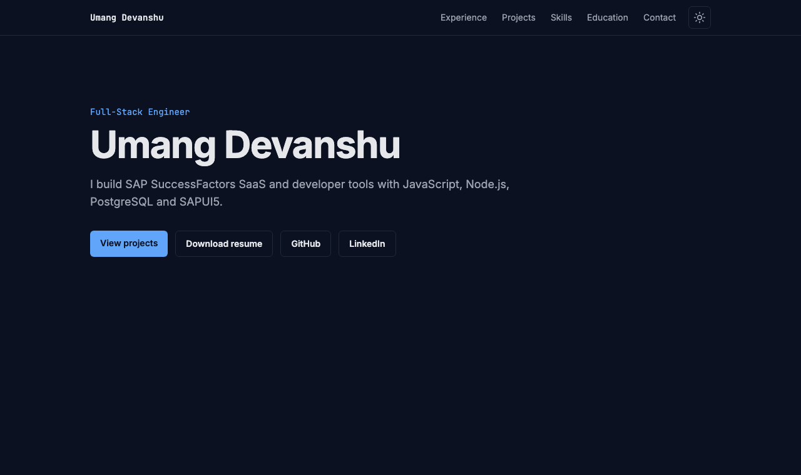

# Portfolio

Personal site of Umang Devanshu, Full-Stack Engineer. Live at https://devumang096.github.io/portfolio/



## Stack

React 19, TypeScript (strict), Vite, Tailwind CSS v4, Framer Motion (LazyMotion), Vitest and React Testing Library, ESLint and Prettier. Fonts (Inter, JetBrains Mono) are self-hosted through Fontsource. No backend; it deploys as a static site to GitHub Pages.

## Run it

```
npm install
npm run dev        # http://localhost:5173/portfolio/
npm test           # Vitest
npm run lint
npm run build      # type-check and production build into dist/
```

## Edit content

Content lives in typed data files. Change data, not components.

| To change                                     | Edit                     |
| --------------------------------------------- | ------------------------ |
| Name, tagline, links, email, resume file name | `src/data/profile.ts`    |
| Jobs and bullets                              | `src/data/experience.ts` |
| Project cards                                 | `src/data/projects.ts`   |
| Skill groups                                  | `src/data/skills.ts`     |
| Education                                     | `src/data/education.ts`  |

The resume PDF goes in `public/Umang_Devanshu_Resume.pdf`. The social preview image is generated from `scripts/generate-og.mjs` with `npm run og`.

## Deploy

Pushing to `main` runs lint, format check, tests and build, then deploys to GitHub Pages. Pull requests run the same checks without deploying. The Vite `base` is `/portfolio/` in `vite.config.ts`.
